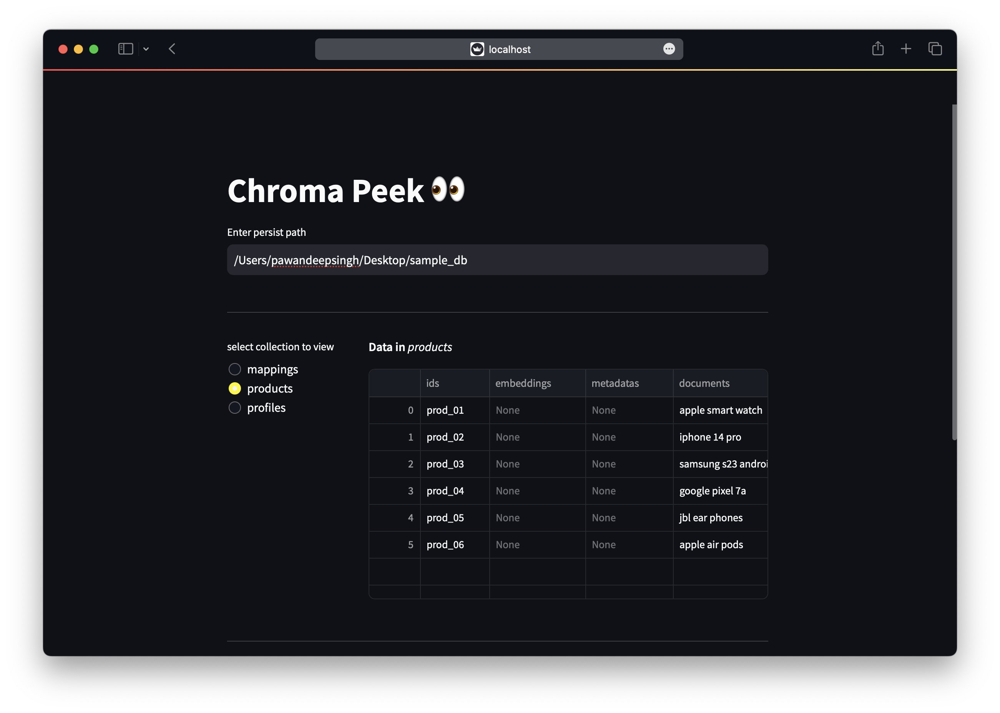
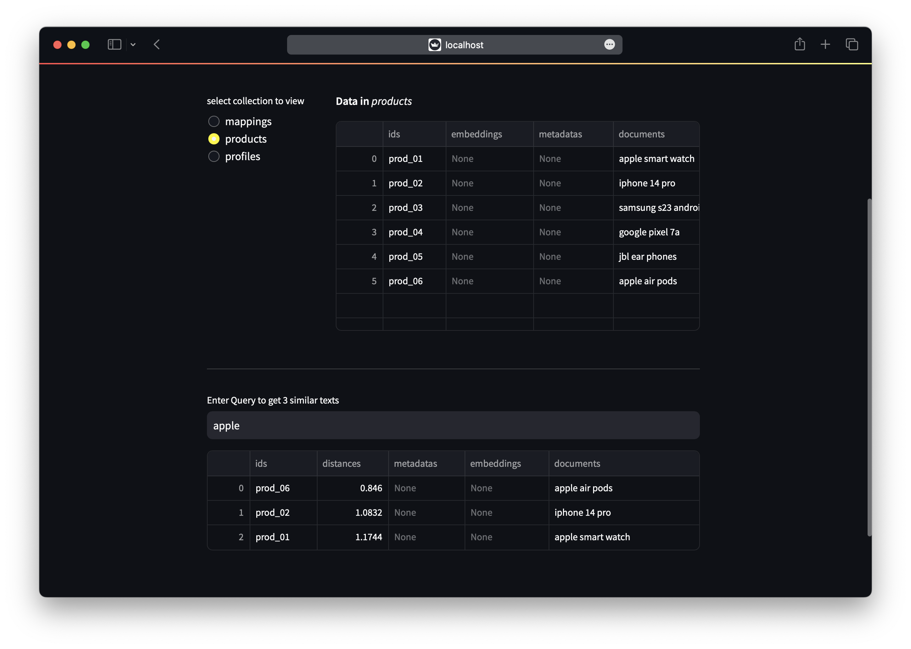

# Chroma-Peek 👀

Welcome to the **ChromaDB Peek** Repository! 👀

Explore your Chroma Database with ease using Chroma-Peek. This tool provides a quick and intuitive way to interact with your vector database. 🚀

## Features ✨

With Chroma-Peek, you can:

1. **Instantly Visualize:** Get an immediate overview of your database.
2. **Simplified Setup:** Just provide the path to your persistence directory, and let us handle the rest.
3. **Effortless Queries:** Easily query your Chroma Database by entering your query in the input field. 💬

## How to Use 🛠️

Follow these steps to get started:

1. **Clone the Repository:**

   ```shell
   git clone https://github.com/Pawandeep-prog/chroma-peek.git
   ```

2. **Install Requirements:**

   ```shell
   pip install -r requirements.txt
   ```

3. **Run the App:**
   ```shell
   streamlit run chroma-peek/main.py
   ```

## Samples




## 📚 More Information

Stay tuned! More information and updates are on the way. Feel free to contribute and enhance the Chroma-Peek experience. Happy peeking! 👁️🔍
